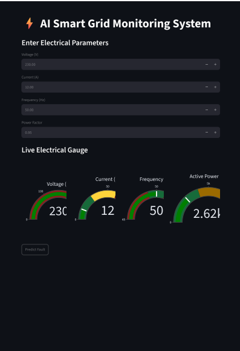
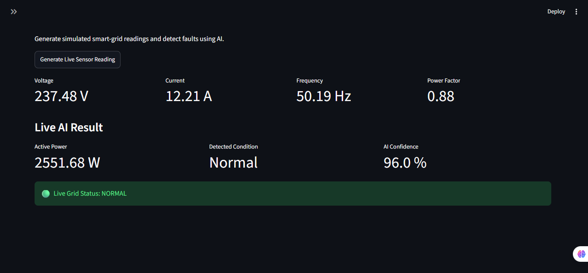
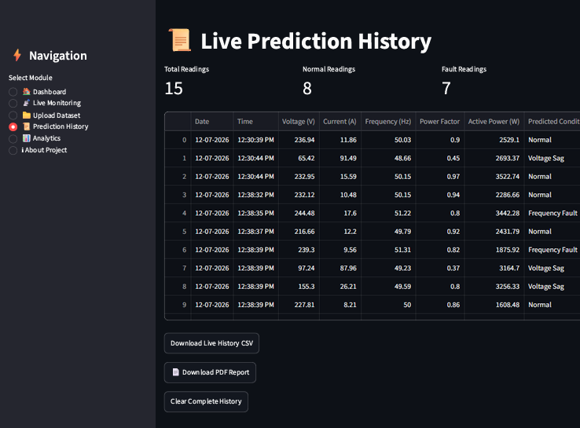
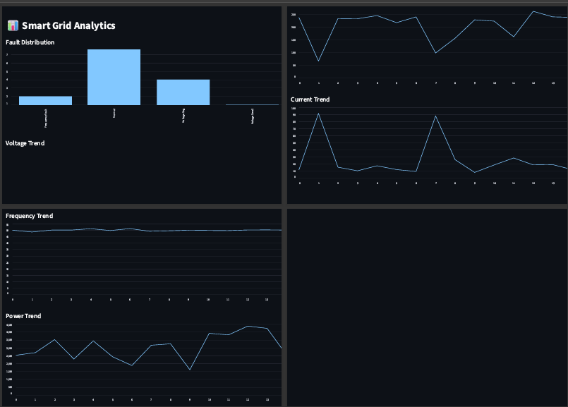
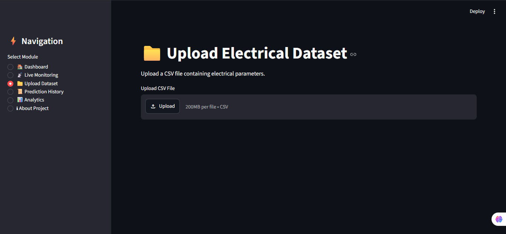
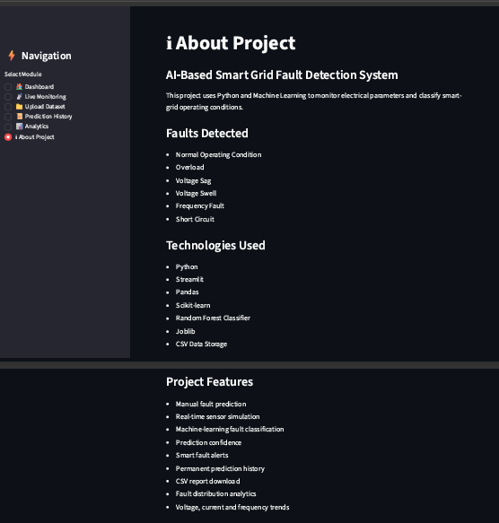

# ⚡ AI Smart Grid Monitoring System
<p align="center">
  <a href="https://smart-grid-monitoring-isha240724.streamlit.app">
    
  </a>
</p>

<p align="center">
  
  
  
  
</p>
## 📌 Project Overview

AI Smart Grid Monitoring System is a Machine Learning based web application developed using Python and Streamlit for intelligent monitoring of electrical parameters and automatic fault detection in smart grids.

The system analyzes Voltage, Current, Frequency, Power Factor and Active Power to predict different electrical faults using a trained Random Forest Machine Learning model.

---

## 🚀 Features

- ⚡ Real-Time Smart Grid Monitoring
- 🤖 AI-Based Fault Detection
- 📊 Interactive Dashboard
- 📈 Live Voltage, Current & Frequency Graphs
- 📁 Upload Your Own Dataset
- 🧠 Train New Machine Learning Model
- 📜 Prediction History
- 📄 PDF Report Generation
- 📥 CSV Export
- 📊 Fault Analytics
- 🎯 Prediction Confidence Score
- 💾 Permanent History Storage

---

## 🛠 Technologies Used

- Python
- Streamlit
- Pandas
- Scikit-Learn
- Plotly
- Joblib
- ReportLab
- Machine Learning
- Random Forest Classifier

---

## 📂 Project Structure

```text
AI-Smart-Grid-Monitoring-System
│
├── app.py
├── smart_grid.py
├── train_model.py
├── predict_fault.py
├── generate_dataset.py
├── evaluate_model.py
├── fault_graph.py
├── fault_pie_chart.py
├── live_trend.py
├── voltage_current_graph.py
├── smart_grid_dataset.csv
├── smart_grid_model.pkl
├── requirements.txt
├── README.md
└── .gitignore
```
---

# 📸 Project Screenshots

## 🏠 Dashboard



---

## 📡 Live Monitoring



---

## 📜 Prediction History



---

## 📊 Analytics



---

## 📁 Upload Dataset



---

## ℹ️ About Project


